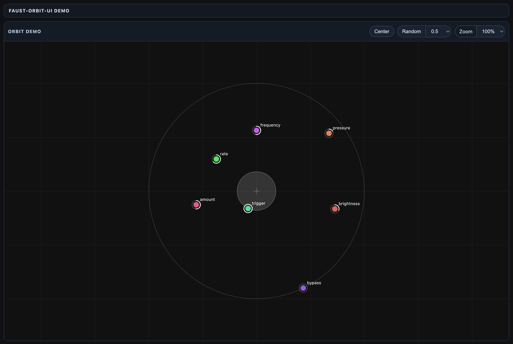

# faust-orbit-ui



Orbit-based UI component for Faust-style parameter control, driven by JSON metadata and callbacks.

## What It Is

`faust-orbit-ui` renders and manages an interactive Orbit control panel from Faust-like UI JSON.

You provide:

- a DOM root element,
- a UI JSON description,
- a callback `paramChangeByUI(path, value)`.

## What It Is Not

- No DSP/audio engine.
- No WebAudio integration.
- No Faust compiler/runtime dependency.

It is a UI layer only.

## Quick Start

Run commands from the repository root.

1. Install dependencies:

```bash
npm install
```

2. Build package:

```bash
npm run build
```

3. Start demo server:

```bash
npm run demo:serve
```

4. Open:

- `http://localhost:4173/demo/index.html`

## Minimal Integration Example

```html
<div id="orbit-root" style="height: 480px"></div>
<link rel="stylesheet" href="./dist/faust-orbit-ui.css" />
<script type="module">
  import { FaustOrbitUI } from './dist/index.js';

  const ui = [
    {
      type: 'vgroup',
      label: 'synth',
      items: [
        { type: 'hslider', label: 'frequency', address: '/synth/frequency', min: 20, max: 2000, step: 1 },
        { type: 'hslider', label: 'pressure', address: '/synth/pressure', min: 0, max: 1, step: 0.01 },
        { type: 'button', label: 'trigger', address: '/synth/trigger' }
      ]
    }
  ];

  const root = document.getElementById('orbit-root');
  const orbit = new FaustOrbitUI(root, (path, value) => {
    console.log('paramChangeByUI', path, value);
  });

  const state = orbit.buildControlsFromUnknown(ui);
  orbit.setOrbitState(state);
</script>
```

## Public API (Core)

```ts
new FaustOrbitUI(root, paramChangeByUI, options?)
```

### Constructor

- `root: HTMLElement`
- `paramChangeByUI: (path: string, value: number) => void`
- `options?: FaustOrbitUIOptions`

### Main methods

- `buildControlsFromUnknown(input: unknown): OrbitState`
- `setOrbitState(state: OrbitState): void`
- `getOrbitState(): OrbitState`
- `setParamValue(path: string, value: number): void`
- `random(c: number): void`
- `center(): void`
- `beginUpdate(): void`
- `endUpdate(): void`
- `destroy(): void`

## Options

Main options in `FaustOrbitUIOptions`:

- `title?: string`
- `disabledPaths?: string[]`
- `onOrbitStateChange?: (state) => void`
- `onInteractionStart?: () => void`
- `onInteractionEnd?: () => void`
- `tooltips?: { ... }`

## UI JSON Expectations

Input should follow the common Faust UI metadata shape:

- groups: `vgroup`, `hgroup`, `tgroup`
- active widgets: `hslider`, `vslider`, `nentry`, `button`, `checkbox`
- passive widgets are parsed but not interactive controls in Orbit.

Unknown nodes are ignored. Invalid top-level input (not an array) throws.

## CSS

The package exposes Orbit stylesheet at:

- `faust-orbit-ui/faust-orbit-ui.css`

No automatic style injection is done by JS.

You must include the CSS in your host app.

## Demo vs Package Usage

- `demo/` is only an example app.
- `src/` + `dist/` are the package itself.

## Troubleshooting

### `OSError: [Errno 48] Address already in use`

Port `4173` is already used.

Use another port:

```bash
python3 -m http.server 4174 -d .
```

Then open `http://localhost:4174/demo/index.html`.

### Orbit panel appears empty

Check both:

- CSS is loaded (`faust-orbit-ui.css`).
- Root element has explicit height (or parent layout gives it height).

## Repository Layout

- `src/`: package source
- `dist/`: build output
- `demo/`: browser demo app

## Publishing Checklist

Before publishing to npm:

1. Remove `"private": true` from `package.json`.
2. Bump `version`.
3. Build with `npm run build`.
4. Publish with `npm publish --access public`.
