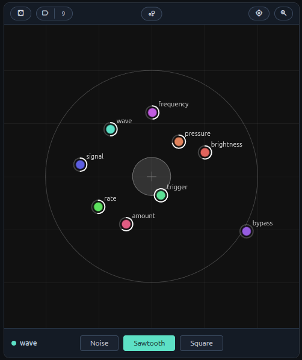

# faust-orbit-ui



Orbit-based UI component for Faust-style parameter control with a built-in preset library, projection / Shepard navigation overlay, dwell-based auto-promotion, looped playback, undo/redo, and a recall menu — all driven by JSON metadata and callbacks. No DSP / audio engine inside.

## What it is

The package exposes two classes:

- **`OrbitUI`** — the recommended API. A self-contained component that owns its `uiHash`, a preset library, the level-1 calque overlay (PCA + Shepard), the loop machinery, undo/redo scopes, and the toolbar. The host gets `setLibrary` / `setSelection` / `setTrajectory` / `setLoopSettings` / `setParams` for sync-in, and `onLibraryChange` / `onSelectionChange` / `onTrajectoryChange` / `onLoopSettingsChange` / `onCommit` for sync-out.
- **`FaustOrbitUI`** — the legacy renderer that draws the parameter dots and detail panel. `OrbitUI` wraps it; you only need it directly if you want the bare orbit view without the library / calque / loop layers.

What this package does **not** do:

- No DSP or audio engine.
- No WebAudio / AudioWorkletNode integration.
- No Faust compiler / runtime dependency.
- No persistence — the host owns the IDB / cloud / file store. The component receives the initial state via setters and emits events on every internal mutation.

## Quick start

```bash
npm install
npm run build
npm run demo:serve
# open http://localhost:4173/demo/
```

The demo wires `OrbitUI` against the legacy `ui.json` and surfaces every emitted event in a side panel — useful for understanding the data flow.

## Minimal integration (`OrbitUI`)

```html
<div id="orbit-root" style="height: 480px"></div>
<link rel="stylesheet" href="./dist/faust-orbit-ui.css" />
<link rel="stylesheet"
      href="https://fonts.googleapis.com/css2?family=Material+Symbols+Outlined:opsz,wght,FILL,GRAD@20..48,400..500,0,0" />
<script type="module">
  import { OrbitUI } from './dist/index.js';

  const ui = [
    {
      type: 'vgroup', label: 'synth',
      items: [
        { type: 'hslider', label: 'frequency', address: '/synth/frequency',
          init: 440, min: 20, max: 2000, step: 1 },
        { type: 'hslider', label: 'pressure', address: '/synth/pressure',
          init: 0.5, min: 0, max: 1, step: 0.01 },
      ],
    },
  ];

  const orbit = new OrbitUI(document.getElementById('orbit-root'), {
    uiDescriptor: ui,
    onParamChange: (path, value) => {
      // forward to your audio runtime
      // node.parameters.get(path).value = value;
    },
    onLibraryChange: (records) => idb.saveLibrary(orbit.uiHash, records),
    onTrajectoryChange: (record) => idb.saveTrajectory(sessionId, record),
    onSelectionChange: (entries) => idb.saveSelection(sessionId, entries),
    onLoopSettingsChange: (settings) => idb.saveLoopSettings(sessionId, settings),
  });

  // After construction, push initial state from the host's store.
  const lib = await idb.loadLibrary(orbit.uiHash);
  if (lib) orbit.setLibrary(lib);
</script>
```

The Material Symbols Outlined font is required for the toolbar icons (`label`, `casino`, `zoom_in`, `bubble_chart`, `delete`, `my_location`, `arrow_forward`).

## Feature surface (`OrbitUI`)

The component bundles seven concerns the host doesn't have to reinvent:

- **Signature identity** — `readonly uiHash: string` derived synchronously from the Faust UI descriptor (sync SHA-256 polyfill — bit-identical to the standard `crypto.subtle` digest of the same canonical input).
- **Preset library** — keyed by `(uiHash, configHash)`, named vs. anonymous distinction, `setLibrary` for sync-in, `onLibraryChange` for sync-out.
- **Calque (level-1 overlay)** — PCA-weighted projection of the library + Shepard inverse for continuous navigation. Click a disc to recall, drag the centre cross to morph, double-click empty space to capture a new preset at the click point. Selection (shift+click toggle, shift+drag marquee), trash, inline rename, right-click context menu.
- **Auto-promotion** — dwell-timer detects stable configurations and memorises them, gated by InGesture / OverlayActive / `setPromotionSuspended`.
- **Loop mode** — cyclic playback through the selection with portamento. Formal state machine + dynamic-selection swap rule documented in [docs/LOOP.md](docs/LOOP.md).
- **Undo / redo** — two scopes:
  - *Library* (per `uiHash`): `add` / `rename` / `delete` / `deleteBatch`. Triggered by `undoLibrary()` / `redoLibrary()`.
  - *Params* (per instance): before/after snapshots per gesture commit. Triggered by `undoParams()` / `redoParams()`.
- **Recall menu** — pill in the toolbar with a `+ Save current state as preset` entry (with inline name input) and the alphabetised list of named presets, gold-✓ on the active one.

## Documentation

| Doc | Scope |
|---|---|
| [docs/API.md](docs/API.md) | Public API surface — constructor, options, methods, events, lifecycle, Cmd+Z routing convention. |
| [docs/DATAMODEL.md](docs/DATAMODEL.md) | Conceptual / mathematical model of every piece of state the component owns at any given instant. |
| [docs/LOOP.md](docs/LOOP.md) | Formal state machine of the loop mode, with the swap rule for live selection edits. |
| [docs/PRESETS.md](docs/PRESETS.md) | The algorithms — PCA-weighted projection, Shepard interpolation, dynamic transitions, dwell auto-promotion. |

## Cmd+Z routing (host-side)

The component exposes both undo scopes through public methods but does NOT register a global keyboard handler. The host decides routing. Recommended pattern:

```ts
window.addEventListener('keydown', (event) => {
  if (!(event.metaKey || event.ctrlKey) || event.key.toLowerCase() !== 'z') return;
  if (event.repeat) return;
  const focused = document.activeElement;
  if (!(focused instanceof HTMLElement)) return;
  if (!focused.closest('.orbit-ui-root')) return;
  // Route on calque visibility, not focus position — toolbar clicks
  // can move focus out of the overlay during a calque session.
  const calqueOpen = !!root.querySelector('.orbit-ui-overlay-active');
  event.preventDefault();
  const isRedo = event.shiftKey;
  if (calqueOpen) (isRedo ? orbit.redoLibrary() : orbit.undoLibrary());
  else            (isRedo ? orbit.redoParams()  : orbit.undoParams());
});
```

The component guarantees two CSS classes for routing decisions:

- `.orbit-ui-root` on the container.
- `.orbit-ui-overlay-active` on the calque overlay when it's open.

## UI JSON expectations

Input should follow the common Faust UI metadata shape:

- groups: `vgroup`, `hgroup`, `tgroup`
- active widgets: `hslider`, `vslider`, `nentry`, `button`, `checkbox`
- passive widgets are parsed but not interactive in Orbit.

Widgets may include a `meta` array carrying e.g. unit information:

```json
{ "type": "hslider", "label": "frequency", "address": "/synth/frequency",
  "min": 20, "max": 2000, "step": 1, "init": 440,
  "meta": [{ "unit": "Hz" }] }
```

`init` is used by the projection module as the default value when a configuration omits an address.

## Legacy `FaustOrbitUI` (bare renderer)

If you only want the orbit view without the library / calque / loop layers, the lower-level class is still exported:

```ts
import { FaustOrbitUI } from './dist/index.js';

const orbit = new FaustOrbitUI(root, paramChangeByUI, options?);
const state = orbit.buildControlsFromUnknown(uiDescriptor);
orbit.setOrbitState(state);
```

Constructor:

- `root: HTMLElement`
- `paramChangeByUI: (path: string, value: number) => void`
- `options?: FaustOrbitUIOptions`

Main methods:

- `buildControlsFromUnknown(input: unknown): OrbitState`
- `setOrbitState(state: OrbitState): void` / `getOrbitState(): OrbitState`
- `setParams(values: Record<string, number>): void` / `setParamValue(path, value)`
- `getParamValues(): Record<string, number>`
- `random(c: number)` / `center()`
- `beginUpdate()` / `endUpdate()` / `destroy()`

`OrbitUI` constructs and wraps a `FaustOrbitUI` internally; the toolbar is the same.

### Detail panel

A fixed-height bar below the orbit canvas shows the last-touched control with a conventional editing interface:

- **Sliders** (`hslider`, `vslider`, `nentry`): editable value field + range slider. The value field shows the unit suffix (e.g. `440 Hz`), strips it on focus for editing, and clamps to min/max on blur.
- **Buttons**: a trigger button with color feedback on press / release.
- **Checkboxes**: a toggle button that stays highlighted when active.

When the calque is open, this detail bar is overlaid by the portamento + loop control bar (`→ Tp slider | ▶/■ play | BPM slider ↻`).

### Keyboard shortcuts (orbit view)

| Key | Action |
|---|---|
| `←` / `→` (calque open) | Step through presets in `lastSeenAt` order (smooth glide via Tp). |
| `←` / `→` (orbit only) | Navigate between controls in the detail panel. |
| `↑` / `↓` (detail panel) | Increment / decrement value by one step. |
| `Space` | Trigger button or toggle checkbox. |
| `R` | Randomize controls. |
| `L` | Toggle the calque. |
| `Escape` | Close the calque (when open) / cancel value input. |
| `Delete` / `Backspace` | Trash selected presets (when calque open). |

## CSS

The package ships a single bundled stylesheet:

```html
<link rel="stylesheet" href="./dist/faust-orbit-ui.css" />
```

It covers both the legacy renderer styles and the calque / dropdown / preset-pill additions. No automatic style injection is done by JS — the host must include the CSS.

## Repository layout

- `src/` — package source
- `dist/` — build output (generated)
- `demo/` — browser demo app driving `OrbitUI` end-to-end
- `docs/` — concept / API / loop / algorithm specs

## Troubleshooting

**Port `4173` already in use** — pick another:

```bash
python3 -m http.server 4174 -d .
```

**Orbit panel appears empty** — check that the CSS is loaded *and* the root element has an explicit height (or its parent layout gives it one).

**Material icons render as `label` / `casino` / `zoom_in` literal text** — the Material Symbols font isn't loaded. Add the Google Fonts `<link>` shown in the integration example.

**`computeUIHashSync` not found / not exported** — make sure you're importing from the package root (`./dist/index.js`); the hash module is re-exported there.

## Publishing checklist

1. Remove `"private": true` from `package.json`.
2. Bump `version`.
3. `npm run build`.
4. `npm publish --access public`.
